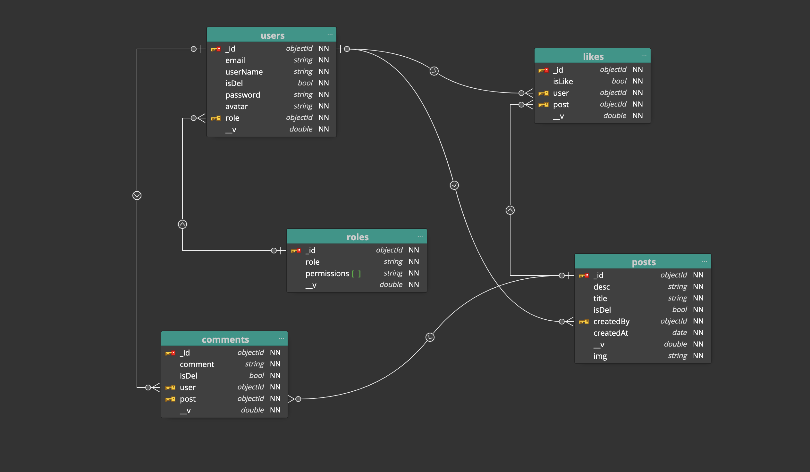
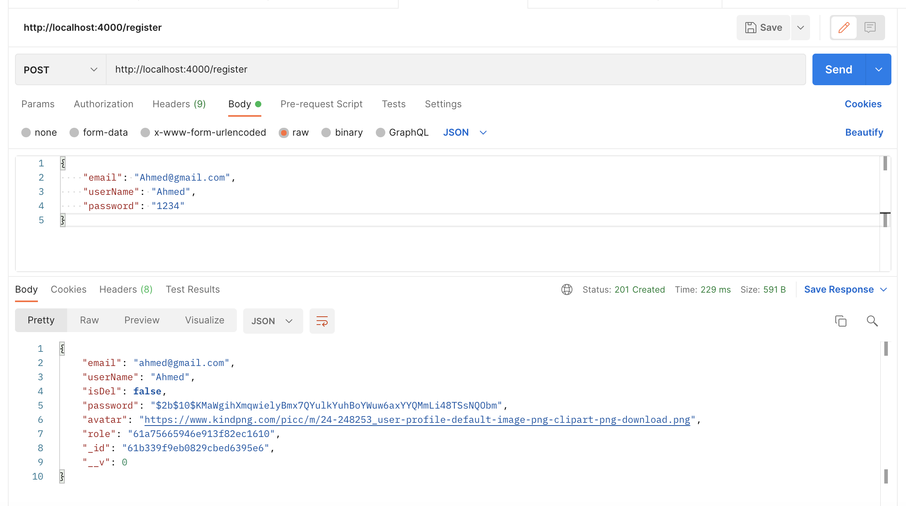

# Social Media Website Backend

this is a project of a social media website builted in Express

# Entity Relationship Diagram (ERD):



# UML Diagram :

# Getting Started

### Installation:

##### Node js:

Follow instructions to install the latest version of Node js for your application in the [Node js docs](https://nodejs.org/en/)

##### NPM Dependencies:

Once you have the project in your local machine, install dependencies by running:

```
npm install
```

**now you have to install required packages:**

- [Express:](https://expressjs.com/en/starter/installing.html)
  Express is a minimal and flexible Node.js web application framework that provides a robust set of features for web and mobile applications.

```
npm i express

```

- [Mongoose: ](https://docs.mongodb.com/manual/installation/) Mongoose is an Object Data Modeling (ODM) library for MongoDB and Node.js. It manages relationships between data, provides schema validation, and is used to translate between objects in code and the representation of those objects in MongoDB.

```
npm i mongoose
```

- [Morgan:](https://www.npmjs.com/package/morgan) morgan is a Node. js and Express middleware to log HTTP requests and errors, and simplifies the process.

```
npm i morgan
```

- [CORS: ](https://www.npmjs.com/package/cors) cors is a Node. js and Express middleware it allows you to make requests from one website to another website in the browser.

```
npm i cors
```

- [Bcrypt:](https://www.npmjs.com/package/bcrypt)
  bcrypt is a library on NPM makes it really easy to hash and compare passwords in Node.

```
npm i bcrypt
```

- [JWT : ](https://www.npmjs.com/search?q=jwt) The JSON web token (JWT) is one method for allowing authentication, without actually storing any information about the user on the system itself.

```
npm i jsonwebtoken
```

##### Setting Up the environment variables :

dotenv allows you to separate secrets from your source code.
First install dotenv to set the secret variables there

```
npm i dotenv
```

then set the secret variables in `.env` file :

```
PORT=4000
DB_URL=`Your MongoDB DB URL`
SALT=`Your SALT here`
SECRET_KEY=`Your SECRET KEY here`
```

##### Now Running the Server

Excute this command to run the server in develpment mode

```
npm run dev
```

or run the server on production mode ,excute :

```
npm start
```

# API Reference :

## Base URL :

This application runs locally on port 4000
BASE_URL= http:/localhost:4000

# CRUD operations:

#### GET

- GET/users

  - To get all users :
    `localhost:4000/users`
    - it's require an **Admin** role

- GET/roles

  - To get all roles :
    `localhost:4000/roles`
    - it's require an **Admin** role

- GET/posts

  - To get all posts :
    `localhost:4000/posts`
    - it's require an **User** role

- GET/post/:id

  - To get a post by it's id :
    `localhost:4000/post/61a77f5a6a615ed4bf416b6c`
    - it's require an **User** role

#### POST

- POST/Role

  - to create a new role :
    `localhost:4000/role`
    - it's require an **Admin** role
  - Request Body:
    - role
    - permissions

- POST/User

- to sign Up as a new user :
  `localhost:4000/register`
- Request Body:

  - email
  - userName
  - password
  - role (By default: user)
  - avatar (optinal)

- POST/Post

  - to create a new post :
    `localhost:4000/post`
    - it's require an **User** role
  - Request Body:
    - desc (description)
    - title
    - img (optinal)
    - token

- POST/Comment

  - to create a new comment :
    `localhost:4000/comment`
    - it's require an **User** role
  - Request Body:
    - comment
    - postID
    - token

##### PUT

- PUT/post/:id

  - to edit a post in this application :
    `localhost:4000/post/61a77f5a6a615ed4bf416b6c`
    - it's require an **User** role
  - Request Body:
    - desc (optinal)
    - img (optinal)

- PUT/postDel/:id

  - to remove a post by the user :
    `localhost:4000/postDel/61a77f5a6a615ed4bf416b6c"`
    - it's require an **User** role

- PUT/comment/:id

  - to edit a comment by user :
    `localhost:4000/comment/61a77f5a6a615ed4bf416b6c`
    - it's require an **User** role
  - Request Body:
    - comment

##### Delete :

- DELETE/remove/:id
  - to remove user account by admin :
    `localhost:4000/remove/61a75885006027455726dd8b`
    - it's require an **Admin** role

# Tools :

### \* [Postman: ](https://www.postman.com/downloads/)

Postman is an application used for API testing. It is an HTTP client that tests HTTP requests, utilizing a graphical user interface, through which we obtain different types of responses that need to be subsequently validated.



### \* [MongoDB Compass:](https://docs.mongodb.com/manual/installation/)

MongoDB Compass is a powerful GUI for querying, aggregating, and analyzing your MongoDB data in a visual environment.
